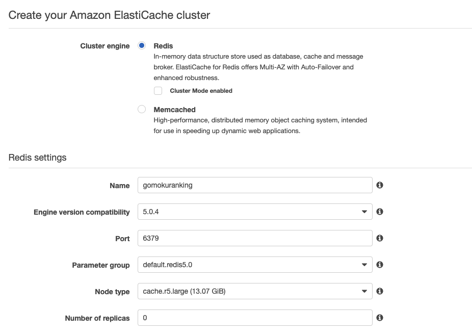
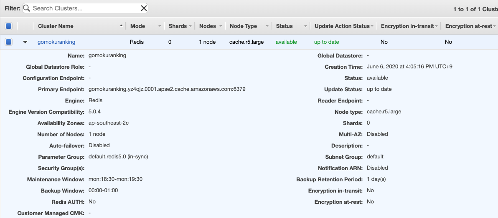
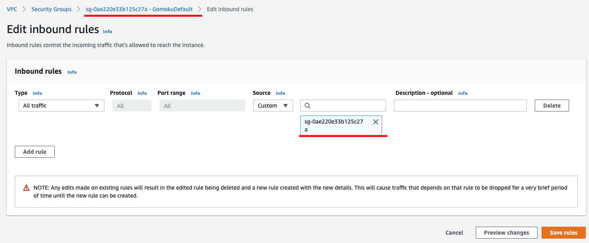
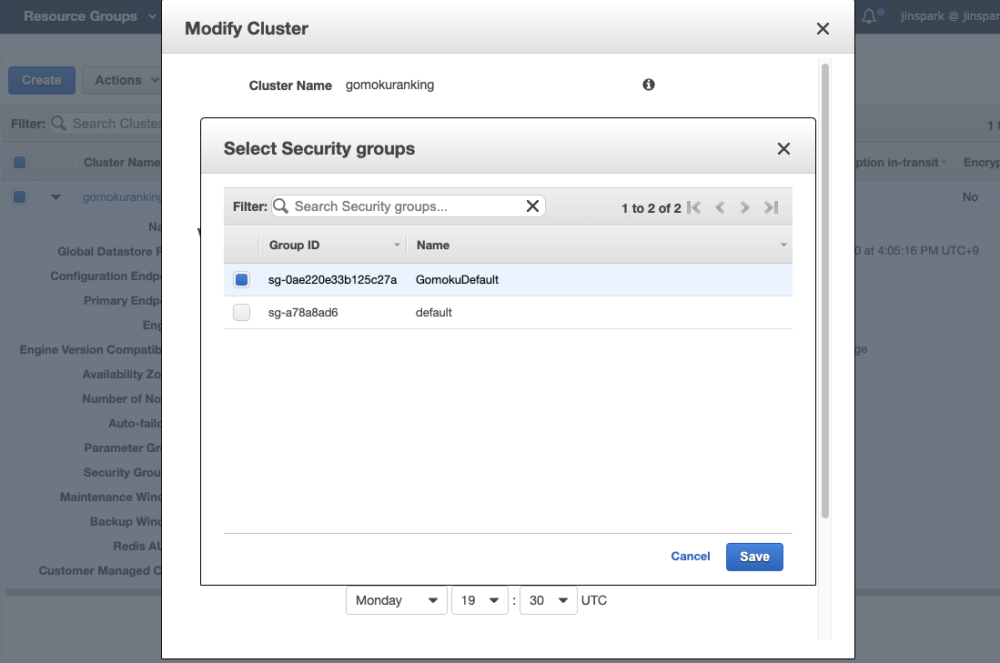

### ElastiCache Configuration   

Nextly, we will configure ElastiCache. This cache will store ranking data.

1. Move to ElastiCache Console on your AWS Console. https://console.aws.amazon.com/elasticache
2. Create ElastiCache cluster. We are using Redis. 
3. Fill the information like below.

* Name: gomokuranking    
* Engine: 5.0.x (5.0.4 above recommended)    
* Port: 6379 (default)    
* Parameter group: default    
* Number of replicas: 0    

4. Click "Create" button to create "Redis". (It takes time to create Redis)

5. If you would like to make ElastiCache on specific VPC, you can configure VPC settings on "Advanced Redis settings".

6. When Redis cluster turns it's status "Available", check Primary Endpoint. We use this endpoint on our Lambda functions.

7. Nextly, make Security Group for this ElastiCache. We are making very simple Security Group for our resources.

8. Let's move to VPC console(https://console.aws.amazon.com/vpc). Click "Security Group" menu on left side tab and create Security Group.

9. Put right information on Name tag, Group name, etc and Select default VPC.

10. We should fix inbound policy in this security group. Select Security Group and Click Inbound Rules.

11. Click "Edit" button, and create inbound policy like below. Put **Security Group ID itself as source**. In this policy, it is able to communicate between resources that have this security group.

Type: All traffic
Protocol: All
Source: Security Group itself

12. After you finish creating Security Group, move to ElastiCache Console. Select Redis that we made.

13. Click "Modify" on the above, Modify Security Group settings to apply Security Group that we created before

Now we finish ElastiCache configurations, next page is for SQS.

---

© 2020 Amazon Web Services, Inc. 또는 자회사, All rights reserved.

