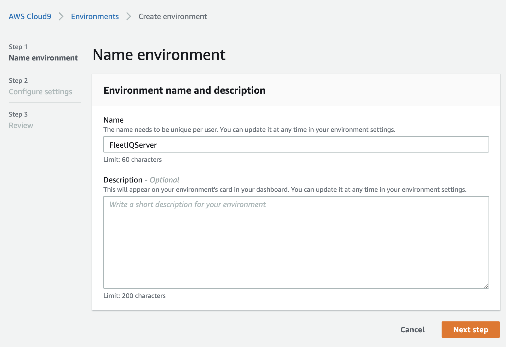
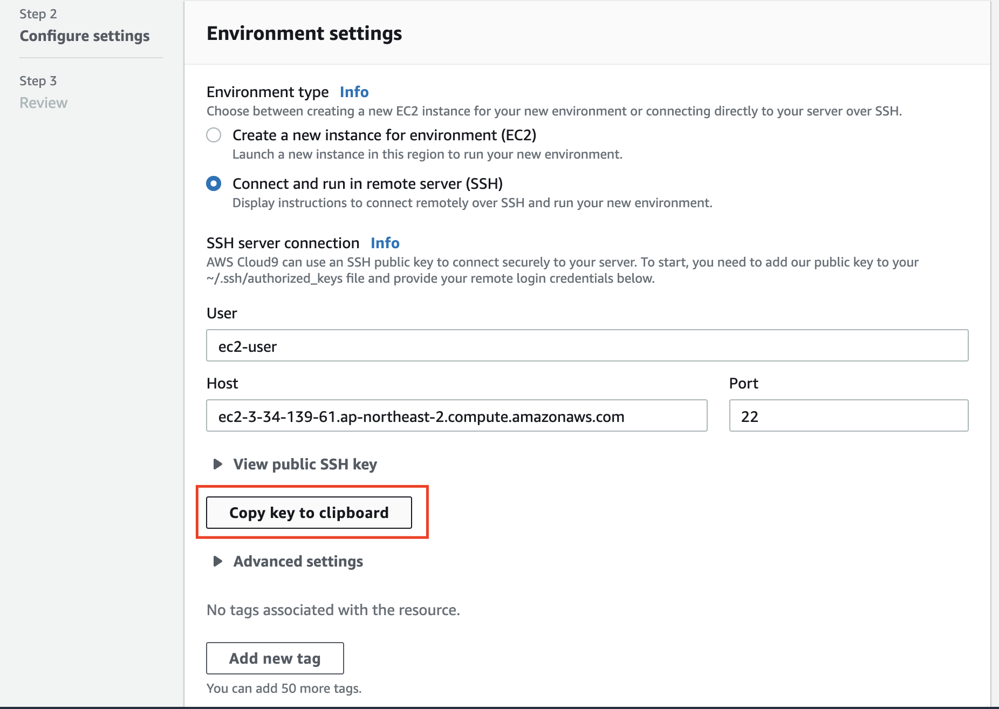
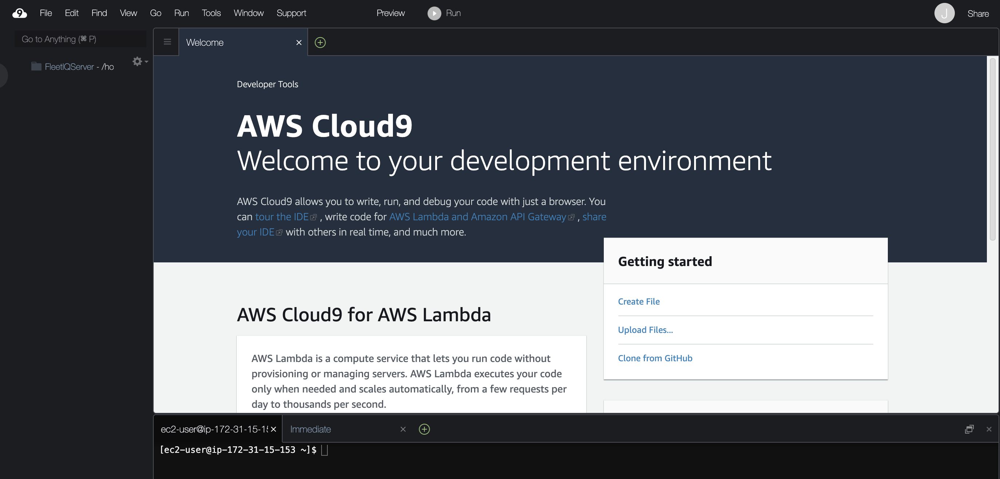

### Making FleetIQ Server development environment    

FleetIQ Server - Client model is not depend on GameLift.
Currently, implementation is provided in the form of CLI and SDK, and in this lab, we will implement Python-based TCP communication.    
It's a simple, and good example of understanding how FleetIQ works and creating a server-client structure.

1. Access to Cloud9 console. (https://console.aws.amazon.com/cloud9/home)

2. Create new IDE as follows. We are making code with this IDE.



3. Set the connection configuration to SSH, and connect the endpoint of the game server instance in the game server group that you have just created. At this time, you need to copy and connect the SSH key at the bottom.



4. If you copy SSH key, connect to the instance on EC2 console.

* You can use **EC2 Instance Connect** for this action. Click the instance and find "Connect" button on console.
* Or you are able to connect via SSH or PuTTY.

```ssh
vi ~/.ssh/authorized_keys
```

Put command above, and append copied text to the end of this file.

```ssh
ssh-rsa ~~~ key
ssh-rsa @@@ xxx@amazon.com
```

Then the file seems like above.

**For easy configuration, typing A as the vi reference moves to the end of the file. After hitting the Enter key, paste and save.**

5. Enter the following script in the server instance's console:

```ssh
curl -L https://raw.githubusercontent.com/c9/install/master/install.sh | bash
```

Cloud9 is easily installed on your EC2 instance via the above script.

6. Go back to the Cloud9 console and complete the configuration. The IDE should be configured as follows.




### Writing Server side script

1. Copy the following server script. We will modify this code one by one.

```python
import socket
import boto3
import requests


GameServerGroupName = 'GameServerGroups'
GameServerId = 'game-server-1'
InstanceId = requests.get('http://169.254.169.254/latest/meta-data/instance-id').text
ConnectionInfo = requests.get('http://169.254.169.254/latest/meta-data/public-hostname').text

client = boto3.client('gamelift', 'ap-northeast-2')

server_socket = socket.socket(socket.AF_INET, socket.SOCK_STREAM)
server_socket.bind(("", 5000))
server_socket.listen(5)

def list_game_servers():
    pass

# Register GameServer
def register_game_server():
    pass
#

# Update GameServer
def update_game_server(flag):
    pass
#

# Deregister GameServer
def deregister_game_server():
    pass
#

print("TCP server waiting for Client on port 5000")

while True:
    # List Game Server 
    listResponse = list_game_servers()

    if not 'GameServers' in listResponse or not any(server['GameServerId'] == GameServerId for server in listResponse['GameServers']):
        # Register Game Server to Game Server Group
        register_game_server()
        #

    # Update Game Server Status "AVAILABLE"
    update_game_server(True)
    #

    client_socket, address = server_socket.accept()
    print("I got connection from ", address)

    # Update Game Server Status "UTILIZED"
    update_game_server(False)
    #

    while True:
        data = client_socket.recv(512).decode()
        print("RECEIVED:", data)
        if(data == 'q' or data == 'Q'):
            client_socket.close()
            break
        else:
            client_socket.send(data.encode())

    # Deregister Game Server
    deregister_game_server()
    #

server_socket.close()
print("SOCKET Closed... End")

```

**First, in the code above, change the region to the region where you are practicing. Then, change the top GameServerGroupName to the game server group name you configured earlier. GameServerId should be uniquely specified in Game Server Group.**

2. Fill in the contents of each empty function code. First, the list_game_servers function.

```python
def list_game_servers():
    response = client.list_game_servers(
        GameServerGroupName=GameServerGroupName
    )
    print(response)
    return response
```

This function checks the game servers in the game server group currently available. If it is empty, you need to **register** a new one.

3. Next, register the game server. The following code demonstrates registering an instance of the game server itself with a server group.

```python
def register_game_server():
    response = client.register_game_server(
        GameServerGroupName=GameServerGroupName,
        GameServerId=GameServerId,
        InstanceId=InstanceId,
        ConnectionInfo=ConnectionInfo
    )
    print(response)
```

4. The update_game_server function reports whether the server itself is currently available. It can also play a role of FleetIQ's health check process.

```python
def update_game_server(flag):
    if flag == True:
        return client.update_game_server(
            GameServerGroupName=GameServerGroupName,
            GameServerId=GameServerId,
            HealthCheck="HEALTHY",
            UtilizationStatus="AVAILABLE"
        )
    else:
        return client.update_game_server(
            GameServerGroupName=GameServerGroupName,
            GameServerId=GameServerId,
            HealthCheck="HEALTHY",
            UtilizationStatus="UTILIZED"
        )
```

5. The deregister_game_server function is a function that unregisters a game server. 
In this example, since it is a server that handles a single client, it is released after the loop and re-registered on the next connection, but the actual implementation adjusts the game server's lifecycle according to the client handling logic.


```python
def deregister_game_server():
    response = client.deregister_game_server(
        GameServerGroupName=GameServerGroupName,
        GameServerId=GameServerId
    )
    print(response)
```

6. Next, let's implement the client.


---
<p align="left">
© 2020 Amazon Web Services, Inc. 또는 자회사, All rights reserved.
</p>
