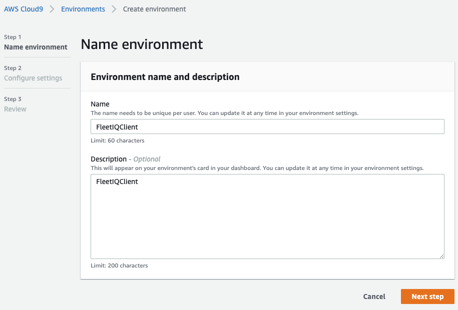
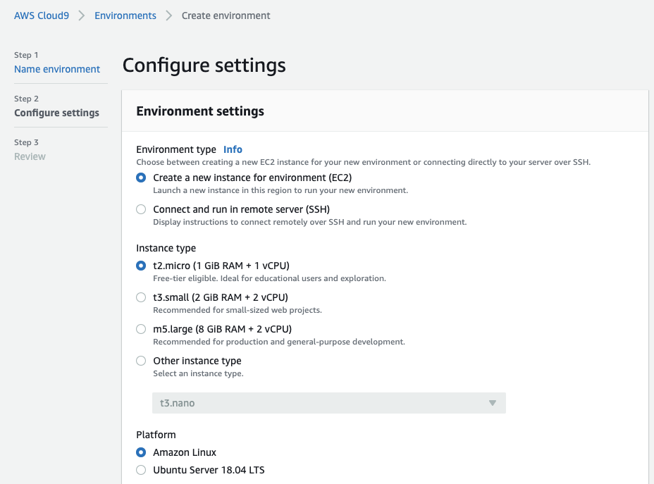

### Create Development Environment based on Cloud9

In this lab, we will use Cloud9, a Cloud-based IDE, to easily build a remote development environment and create a client for the FleetIQ example.

With Cloud9, you can build a consistent online integrated development environment without any changes to the local environment or difficulty in configuring the development environment.

1. Access to Cloud9 console. (https://ap-northeast-2.console.aws.amazon.com/cloud9/home/product)

2. Set name as *FleetIQClient*



3. Specify it as an EC2 environment and choose the appropriate instance type. Network settings are configured to be located in the default VPC.



4. Wait for creation of Cloud9. It will take few minutes.

5. When Cloud9 IDE is executed, create file *client.py* and paste following code.

```python
import socket
import boto3

client = boto3.client('gamelift')

# Claim Game Server
def claim_game_server():
    pass
#
response = claim_game_server()
#endpoint = response['GameServer']['ConnectionInfo']
endpoint = ''

client_socket = socket.socket(socket.AF_INET, socket.SOCK_STREAM)
client_socket.connect((endpoint, 5000))

while True:
    data = input("SEND(TYPE q or Q to Quit):")
    if(data == 'q' or data == 'Q'):
        client_socket.send(data.encode())
        client_socket.close()
        break
    else:
        client_socket.send(data.encode())
    data = client_socket.recv(512).decode()
    print("RECEIVED:", data)

print("Socket Closed... END")
```

**This code is a simple TCP echo client implementation. However, if you look closely, the server's endpoint is not specified. Now let's implement this part.**

6. You must implement the claim_game_server function in your code. The claimGameServer API is an API that requests GameLift FleetIQ for a server instance suitable for allocating game sessions to clients.    
The client only needs to make a request through the corresponding API to connect to the game server.    
Let's make a code on *claim_game_server* as follows.

```python
def claim_game_server():
    response = client.claim_game_server(
        GameServerGroupName='GameServerGroups'
    )
    print(response)
    return response
```

Function's return value contains Game Server endpoint. Remove comment and set endpoint like below.

```python
endpoint = response['GameServer']['ConnectionInfo']
```

7. The complete code is:

```python
import socket
import boto3

client = boto3.client('gamelift', 'ap-northeast-2')

# Claim Game Server
def claim_game_server():
    response = client.claim_game_server(
        GameServerGroupName='GameServerGroups'
    )
    print(response)
    return response
#
response = claim_game_server()
endpoint = response['GameServer']['ConnectionInfo']

client_socket = socket.socket(socket.AF_INET, socket.SOCK_STREAM)
client_socket.connect((endpoint, 5000))

while True:
    data = input("SEND(TYPE q or Q to Quit):")
    if(data == 'q' or data == 'Q'):
        client_socket.send(data.encode())
        client_socket.close()
        break
    else:
        client_socket.send(data.encode())
    data = client_socket.recv(512).decode()
    print("RECEIVED:", data)

print("Socket Closed... END")
```


In the lab, only a simple TCP connection is configured for the purpose of learning to run the FleetIQ API, but the code is simple, but you can practice with more complex game logic.

**Now let's see how the server and client interact with the one we created earlier.**

---
<p align="left">
© 2020 Amazon Web Services, Inc. 또는 자회사, All rights reserved.
</p>
