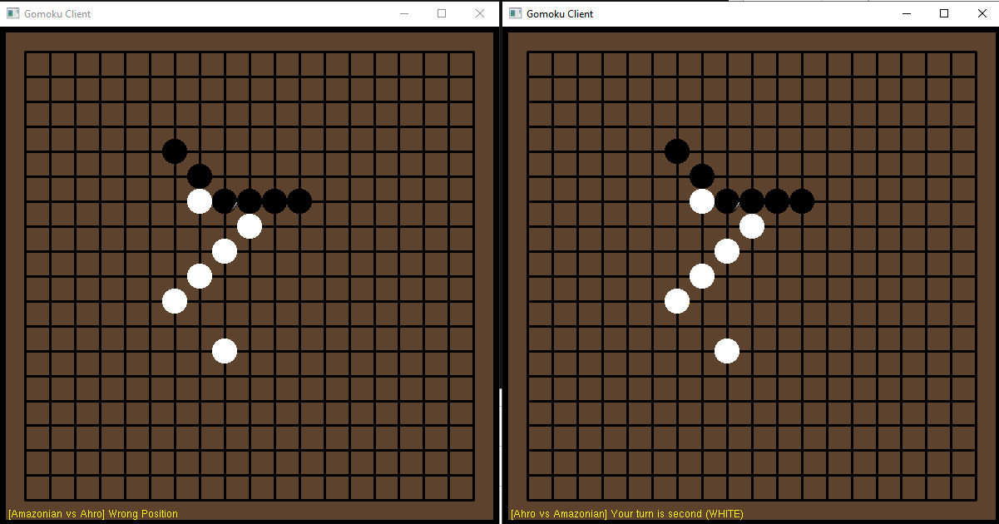

### Connecting Game Client with FlexMatch   

To use FlexMatch, game server or client should be modified to use FlexMatch functions.
In this Lab, we make game client send requests to Lambda functions that we made previously, and Lambda functions match game sessions with FlexMatch functions.

We are using Gomoku Client on Windows OS.

Our game client makes two Outbound TCP connections. So, please check if you need to configure your firewall.

1. Find Game Client on **bin/FlexMatch/Client_player1** in given binary files.

2. We need to modify config.ini at this client.

3. Put API Gateway URL that we made previously on MATCH_SERVER_API.

4. Save with PLAYER_NAME and PLAYER_PASSWD. If player does not exist, game server registers new user. But if given password is wrong, login fails.

5. Run Game Client(GomokuClient.exe) on your system. It will work like picture below.

6. Gomoku should be played with others! Open config.ini at **bin/FlexMatch/Client_player2** and modify the config.

7. Launch secondary Game Client, and start playing!

8. You can give up when it is impossible to win.

9. Test Matchmaking with changing DynamoDB scores.

Congratulations! This is all for GameLift and FlexMatch Lab.

After this part, you are able to try **FlexMatch Advanced features** and **GameLift FleetIQ**. :)

---

© 2020 Amazon Web Services, Inc. 또는 자회사, All rights reserved.

