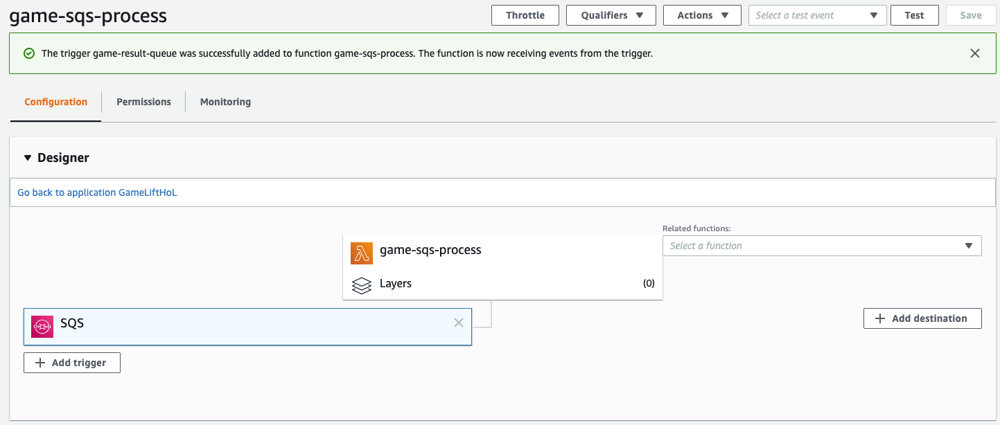
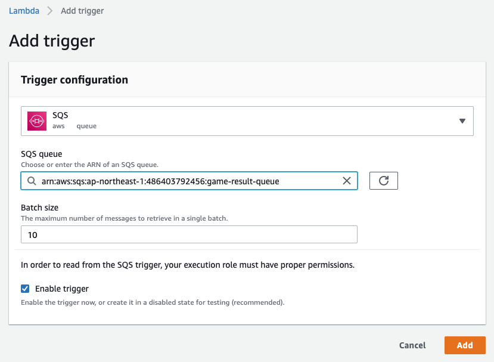
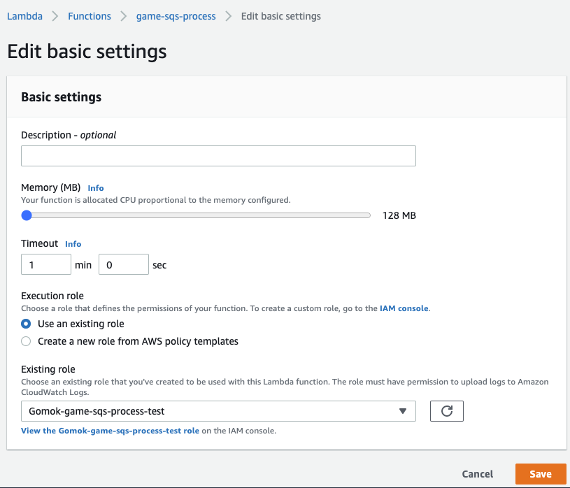
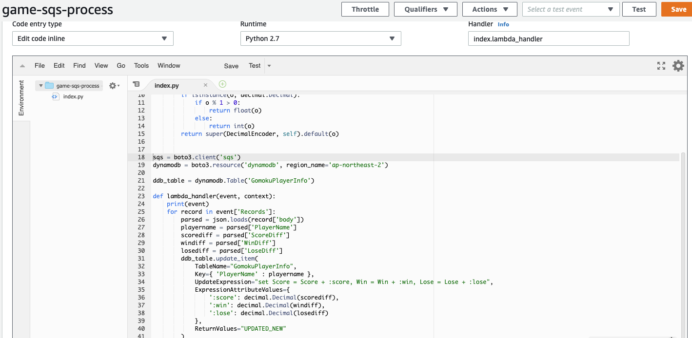
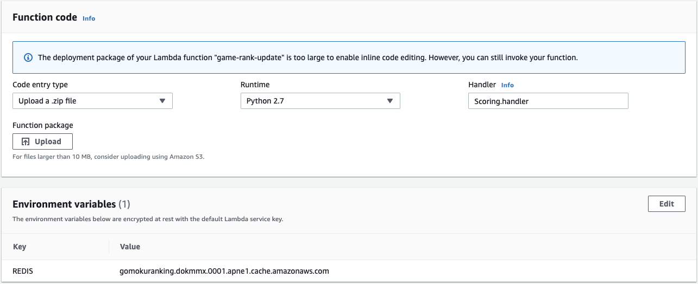
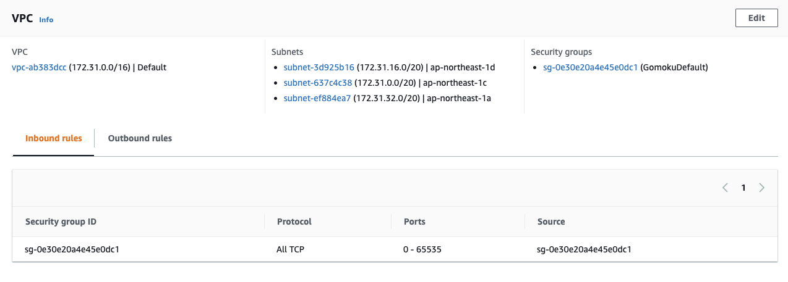
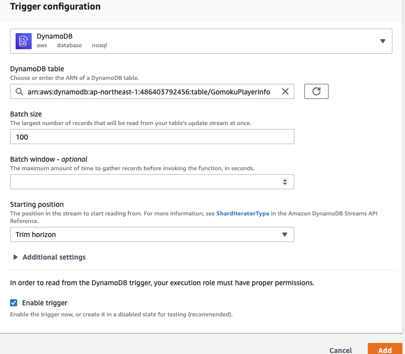
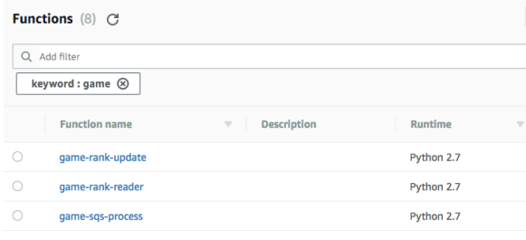

{}
If you deploy CloudFormation stack, Lambda functions and API Gateway have already been made. You should put required part of these resources.
{}

### Making Lambda Functions <br/><br/>

Until last part, we have made AWS services for Full Stack Game. From now on, we are making Lambda functions to handle Game Process.

In this lab, we are creating Three Lambda functions.

Let's make first one.

1. Move to Lambda menu on console. https://console.aws.amazon.com/lambda

2. Click "Create function" button and create first function.

3. Select "Author from scratch", and create empty function.

4. Put *game-sqs-process* as Name.

5. Select Runtime as Python 2.7.

6. In Permissions tab, choose "Use an existing role" and select "Gomok-game-sqs-process". Execute "Create function".

7. When it is completed, select SQS(Simple Queue Service) as trigger of this function on Designer Group. Than you can create "Configure triggers" group below.



8. Check SQS queue. It should indicate arn of SQS that has been created before.



Advanced settings: 128MB Memory and 1 min timeout



9. Let's move back to Designer Group. We are making Lambda functions. Please refer "GameResultProcessing.py" on your source code (Root Folder > Lambda > GameResultProcessing.py).

Code: Copy contents of GameResultProcessing.py and Paste code to Lambda function. Change proper region_name for your lab. (ex: ap-northeast-2)



{}
Please check Lambda functions *Handler*. Lambda function can access this handler when it is executed.
{}

10. Click "Save" button to create function. Created function read game result record that is stored in SQS, and update DynamoDB. Lambda function polls SQS queue continously, gets message and updates DynamoDB table.

{}
In this lab, we provide Python Package for comfort. For source codes GetRank.py and Scoring.py, please refer **Lambda / LambdaDeploy**.
{}

Second Lambda function will be created by uploading Python package.
Unlike First function only uses Python standard SDK for its logic, some Lambda functions use External Library like Redis.
So, we are using Deploy package for making lambda functions.

It will be a good opportunity to make lambda functions with package.


1. You can see two Python files GetRank.py and Scoring.py under Lambda/LambdaDeploy.

2. Compress All files on the folder as name "LambdaDeploy.zip" (Notice: LambdaDeploy should not be included on the zipped file. GetRank.py and Scoring.py should be located root path of the compressed file)

3. We can make Lambda function using this Deploy Package.

4. Click "Create Function" and select "Author from scratch" to create function.

5. Set Name as game-rank-update, and Runtime as Python 2.7, Role as Gomok-game-rank-update. Click Create function button.

6. Select **Upload a .ZIP file** in Function code Group, and upload LambdaDeploy.zip.

7. Put *Scoring.handler* as Handler, and ElastiCache Endpoint(we made before) for Environment Variables like below.    
You can manage endpoint safely and efficiently using this Environment Variables without hard-coding.



8. Set function Timeout 1 minute.

9. Set VPC same as ElastiCache in function configuration. Select all Subnets and Security Group that we made before (GomokuDefault).



10. Select DynamoDB as Triggers on Designer Group above.


11. We are using DynamoDB Table "GomokuPlayerInfo" as Configuration Trigger of Lambda function. Setting DynamoDB trigger like below. Check "Enable Trigger" and click Add button.



12. After process is completed, click "Save" button. For now, it will be failed if you click Test for this function.

Last but not least, let's make 3rd Lambda function. It can be made same way.

1. Create Lambda function with "Author from scratch".

2. Put function name game-rank-reader, Python 2.7 as Runtime, set Gomok-game-rank-reader as Role.

3. Click Create function, select "Upload a .ZIP file" on Code entry type. Upload LambdaDeploy.zip for this function.

4. Put **GetRank.handler** in Function Code Handler. Make Environment variable as same as before.
* Key : REDIS
* Value : [ElastiCache Endpoint without port number]

5. Set Timeout 1 minute in Basic settings. Configure VPC as same as VPC that ElastiCache is located. Select all subnets and Security Group that we made previously.

6. Save and Complete Lambda function.

Now we can check Three Lambda functions are made. (If you tried CloudFormation, that there would be Five)



Lambda functions are prepared! Nextly, we are considering how to run these functions.
First two functions are triggered by SQS and DynamoDB, but we have not designated trigger for last function.

We are using API Gateway for this function. Let's make API Gateway!

---

#### Lambda function Test <br/><br/>


If you finished this page, you are able to test how components that we made work.    
When SQS takes data, Lambda functions will be triggered. And the function updates data to DynamoDB.
Data updated to DynamoDB, triggers another Lambda function by DynamoDB Stream. And this function updates Redis Cache for Ranking Leaderboard.

We can test this process simply.

1. Open console to access SQS (https://console.aws.amazon.com/sqs)
2. Select game-result-queue and click Queue Actions button.
3. Click Send Message from drop-down.
4. Put JSON data like below on the text box.
```json
{ "PlayerName" : "SomeName" , "WinDiff" : 1, "LoseDiff" : 0, "ScoreDiff" : 100 }
```
* If it has parse issue, please put text by yourselves

5. Click "Send Message"
6. You can check Item changed on DynamoDB "GomokuPlayerInfo" table.

* If it has an issue, you are able to debug logs from CloudWatch.

---
<p align="center">
© 2020 Amazon Web Services, Inc. 또는 자회사, All rights reserved.
</p>
